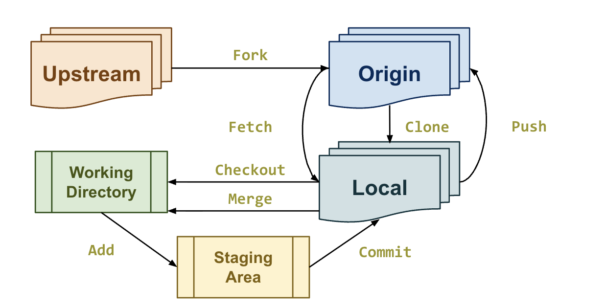
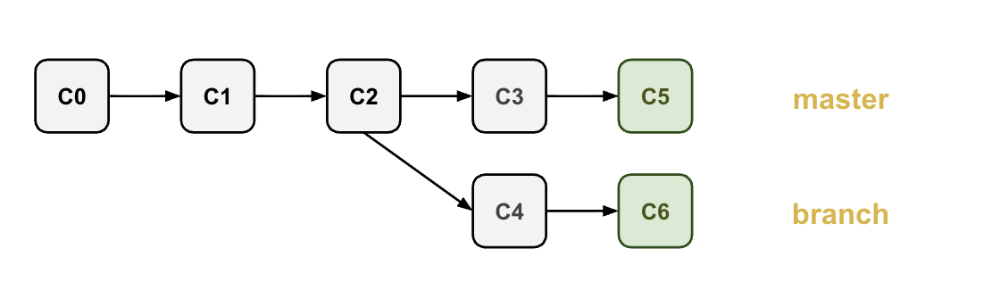

# Git

__Git__ is a distributed version control system
- Git is a __journal__ (a __log__)
    - records transactions
- Git is a __time machine__
    - jump to a previous revision
- Git is a __shared space__
    - it allows for easy collaboration with GitHub, GitLab, etc.

## Vocabulary with how the assginments repository works
1. Original __upstream__ respository was created
2. __Fork__ the upstream to create a personal version called the __origin__
3. __Clone__ the repository to a local machine to create a local version of it using the command `git clone`
4. The cloned repository __checks out__ a working directory
5. After making modifications, modified files enter a __staging area__ using the command `git add`
6. To permanently track these modifications and __commit__ them to the local repository, use the command `git commit`
7. To see all commits, use the `git log` command
8. To __push__ the local changes to the origin, use the `git push` command
9. To get changes from the origin to the local repository, __pull__ the changes using the `git pull` command

## Git Branches
The idea of having a repository with multiple different features

The default branch is either called __master__ or __main__

Commands for branching
- `git switch master` to go to the master branch
- `git pull --rebase` to pull changes from origin to the local repo
    - `--rebase` creates a commit that, instead of combining another branch's commit's into one, adds all commits to the end of that branch
- `git switch -c <branch name>` to create and switch to the new branch
- `git restore` to remove all unstaged changes and revert to the current last commit