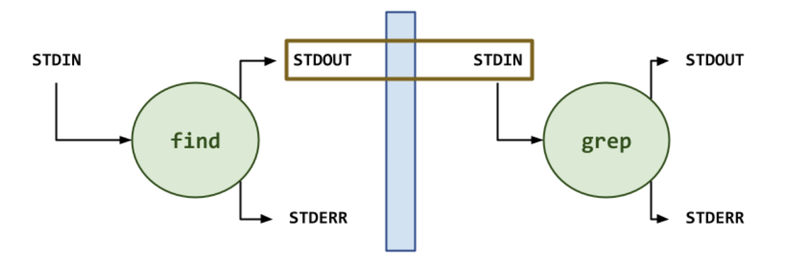

# Processes

A __process__ is a loaded instance of a program into RAM. 

## Pipelines

Each process you make has three files attached: __STDIN (0)__, __STDOUT (1)__, and __STDERR (2)__

A __pipeline__ connects the STDOUT of one program to the STDIN of another program.

## I/O Redirection

To send the STDOUT of a program into a certain file, use the `>` operator\
Ex: `ls -la > ls.file`

If you want to print the output to the terminal AND send STDOUT to a file, use `tee`\
Ex: `ls -la | tee ls.file`

To compare differences in files, you can use `diff`\
Ex: `diff <file1> <file2>`\
*No output is good, that means there are no differences between files!*

Notice that `>` does not send STDERR to the file! To send STDERR to that file too, use `>&` (the modern way) or `> <file> 2>&1` (the old way; redirects STDOUT to file, redirects STDERR to wherever STDOUT is redirected to)\
Notice `2>` sends STDERR somewhere else, it can be sent to another file, or `/dev/null` to be "trashed" (not shown)

## See/Affect Processes

`ps ux` shows all processes for yourself

To end a process, you send it `SIGTERM` using `kill <pid>`

To force-end a process, send it `SIGKILL` using `kill -9 <pid>`

To cause a process to sleep, use `C-z` to sleep the process\
`jobs` will list all jobs, including sleeping ones\
You can kill a job using `kill %<job #>`\
To run a sleeping job in the background, sleep it and use `bg`\
To automatically start a job in the background, use a `&` at the end of the command

You can use `pkill` to kill a named command, not using its pid (Ex: `pkill find` to kill all `find`s)

