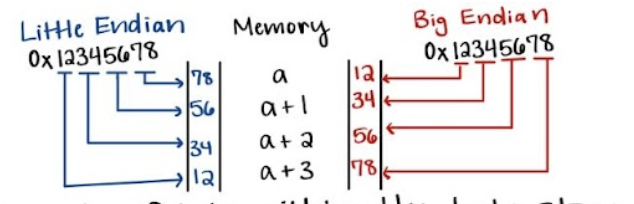

# Unit 3: C

## Compiling and Building

4 step process:
1. Preprocessing - expands the headers, macros, and other preprocessor directives
2. Compile - optimizes C code and converts it into an assembly file
3. Assemble - converts assembly code into object file
4. Link - connects object file with libraries and system, creating the full executable file

__dynamic__ - OS looks for libraries at runtime
- library has to be included in the `LD_LIBRARY_PATH`

__static__ - libraries are prepackaged with executable

Use a __Makefile__ to simplify compiling

### Compiling Libraries
1. Compile the `library.c` file with flag `-fPIC` 
2. For the __dynamic__ version, use `gcc` to link it with `-shared` to create a `.so` file
3. For the __static__ version, use `ar` to archive it with `rcs` to create a `.a` file
4. Then, use `gcc` to link the library with `-l<lib>` to the normal executable, using `-static` for static and nothing for dynamic

## Pointers, Arrays, and Strings

A pointer is an integer whose value is an address

### Arrays
The name of an array is a label to the __first element__

Passing the name of an array to a function decays it to a pointer

### Strings
Strings in C are __arrays of characters__ terminated with a null character `\0`

Defining a string literal `char *s = "dog";` allocates two things:
- the string literal itself into the data segment
- a pointer in the stack pointing to the string literal

Defining a string array like `char s[] = "dog";` allocates one thing:
- the string as an array of characters on the stack

## Memory Allocation

### Address Spaces

- __Stack:__ local variables, function parameters (expands down)
- __Heap:__ user managed memory, malloc/calloc/free (expands up)
- __Data:__ global variables, static variables, string literals
- __Code:__ instructions

### Structs

A __struct__ is a variable that contains many sub-variables of different types

Its size is the sum of the size of all the sub-variables

### Unions

A __union__ is a variable that merges sub-variables into one
- refers to the same chunk of memory as different types

Its size is the size of the biggest sub-variable

Sub-variables' memory is __shared__

### Memory Advice

__Stack__
- Pros: automatic management
- Cons: limited in size
- Conclusions: use whenever possible

__Heap__
- Pros: basically unlimited and persistent (can be used to bring variables out from functions)
- Cons: __you__ are responsible, slower
- Conclusions: use with persistent and/or large data

## Linked Lists

A __linked list__ is a data structure consisting of nodes connected to each other with pointers.

How to traverse a list: `current = current->next;`

Be careful about freeing all nodes 

## Bitsets and Data Representation

### Bitsets

A bitset is an integer (list of bits) that stores information depending on bits marked.

To represent a value, use a bitmask (typically created using bit shifts `1<<x`)

To add a value to a bitset, use logical __OR__ `|` on the bitset and bitmask

To see if the bitset contains a value, use a logical __AND__ `&` on the bitset and bitmask, and the result will equal the bitmask if it contains that value

### Little and Big Endian

__Big Endian:__ most significant byte comes first in memory (lower address)

__Little Endian:__ least significant byte comes first in memory (lower address)

Most machines are little endian, most networking is big endian.
